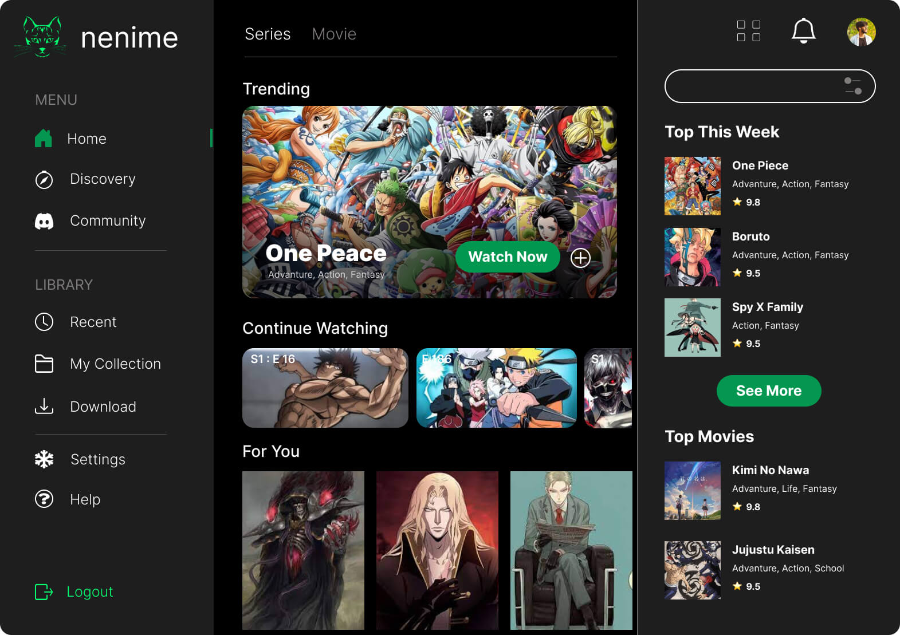
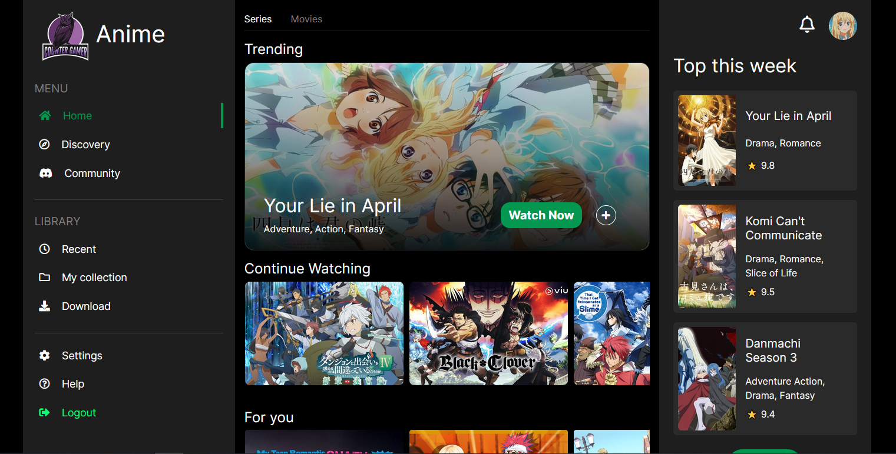

# Anime Stream App with Bootstrap 5

My first markdown readme.

## Technologies used for this small project:

* HTML.
* CSS.
* Font Awesome 5
* Bootstrap 5
* Jquery/Owl Carousel
#

## Original Design:

All credits to owner in Uplabs: [Figma UI Free](https://www.uplabs.com/posts/nenime-web-application-for-anime-lovers)

## My project on bootstrap:

**I need clarify, this design don't have mobile version and tablet version, so i try make ''Responsive Design'' on my mind with bootstrap helpers and my css styles, let me a feedback if i can do some thing best!**

## Desktop Version:

## Tablet (992px breakpoint on Bootstrap):

